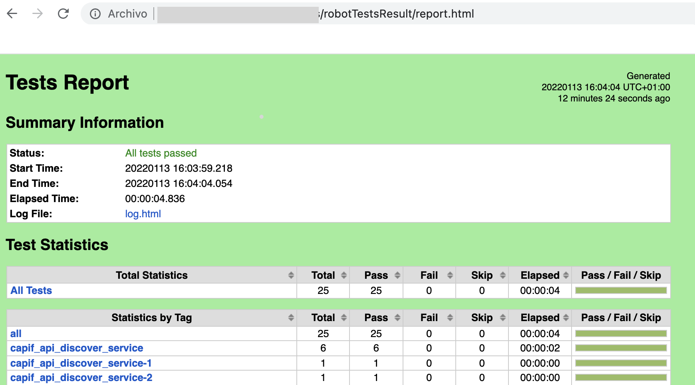

- [Repository structure](#repository-structure)
- [CAPIF_API_Services](#capif_api_services)
  - [How to run CAPIF services in this Repository](#how-to-run-capif-services-in-this-repository)
    - [Run All CAPIF Services locally with Docker images](#run-all-capif-services-locally-with-docker-images)
    - [Run each service using Docker](#run-each-service-using-docker)
    - [Run each service using Python](#run-each-service-using-python)
- [How to test CAPIF APIs](#how-to-test-capif-apis)
  - [Robot Framework](#robot-framework)
    - [Test Plan Documentation](#test-plan-documentation)
    - [Previously Steps](#previously-steps)
    - [Tests Execution](#tests-execution)
    - [Test result review](#test-result-review)
  - [Using Curl](#using-curl)
    - [JWT Authentication APIs](#jwt-authentication-apis)
      - [Register an entity](#register-an-entity)
      - [Get access token for an existing entity](#get-access-token-for-an-existing-entity)
    - [Invoker Management APIs](#invoker-management-apis)
      - [Onboard an Invoker](#onboard-an-invoker)
      - [Update Invoker Details](#update-invoker-details)
      - [Offboard an Invoker](#offboard-an-invoker)
    - [Publish APIs](#publish-apis)
      - [Publish a new API.](#publish-a-new-api)
      - [Update a published service API.](#update-a-published-service-api)
      - [Unpublish a published service API.](#unpublish-a-published-service-api)
      - [Retrieve all published APIs](#retrieve-all-published-apis)
      - [Retrieve a published service API.](#retrieve-a-published-service-api)
    - [Discover API](#discover-api)
      - [Discover published service APIs and retrieve a collection of APIs according to certain filter criteria.](#discover-published-service-apis-and-retrieve-a-collection-of-apis-according-to-certain-filter-criteria)
  - [Using PostMan](#using-postman)
- [Important urls:](#important-urls)
  - [Mongo DB Dashboard](#mongo-db-dashboard)
- [CAPIF Tool Release 1.0](#capif-tool-release-10)


# Repository structure

```
CAPIF_API_Services
└───docs
│    └───test_plan
│    └───testing_with_postman
└───iac
│    └───terraform
└───pac
└───services
└───tests
└───tools
    └───robot
    └───open_api_script
```
* **services**: Services developed following CAPIF API specifications. Also, other complementary services (e.g., NGINX and JWTauth services for the authentication of API consuming entities).
* **tools**: Auxiliary tools. Robot Framework related code and OpenAPI scripts.
* **test**: Tests developed using Robot Framework.

* **docs**: Documents related to the code in the repository.
  * images: images used in the repository
  * test_plan: test plan descriptions for each API service referring to the test that are executed with the Robot Framework.
  * testing_with_postman: auxiliary JSON file needed for the Postman-based examples.
* **iac**: Infrastructure as Code, contains all the files needed for the deployment of the structure that supports the services. (It is used only for the case of non-local deployment of the CCF services e.g., in the Openshift of EVOLVED-5G project)).
    * Terraform: Deploy file.
* **pac**: Jenkins files to manage different automated tasks. (It is used only for the case of non-local deployment of the CCF services e.g., in the Openshift of EVOLVED-5G project).
  * Jenkins Pipelines.

# CAPIF_API_Services
This repository has the python-flask Mockup servers created with openapi-generator related with CAPIF APIS defined here:
https://github.com/jdegre/5GC_APIs

## How to run CAPIF services in this Repository
Capif services are developed under /service/ folder.

### Run All CAPIF Services locally with Docker images
To run using docker and docker-compose you must ensure you have that tools installed at your machine. Also to simplify the process, we have 3 script to control docker images to deploy, check and cleanup.

To run all CAPIF APIs locally using docker and docker-compose you can execute:
```
cd services/

./run.sh

docker exec -it $(docker ps -aqf "name=nginx") bash -c "curl --request GET 'http://easy-rsa:8080/ca-root' 2>/dev/null | jq -r '.certificate' -j > /etc/nginx/certs/ca.crt"
```
This will build and run all services using docker images, including mongodb and nginx locally and in background, and import ca.crt to nginx.

Nginx deployed by default use capifcore hostname, but can add a parameter when run.sh is executed setting a different hostname, for example,
```
./run.sh openshift.evolved-5g.eu
```

If you want to check if all CAPIF services are running properly in local machine after execute run.sh, we can use:
```
./check_services_are_running.sh
```
This shell script will return 0 if all services are running properly.

When we need to stop CAPIF services, we can use next bash script:
```
./clean_capif_docker_services.sh
```
This shell script will remove and clean all CAPIF services started previously with run.sh

### Run each service using Docker

Also you can run service by service using docker:
```
cd <Service>
docker build -t capif_security .
docker run -p 8080:8080 capif_security
```

### Run each service using Python

Run using python
```
cd <Service>
pip3 install -r requirements.txt
python3 -m <service>
```

# How to test CAPIF APIs
The above APIs can be tested either with "curl" command, POSTMAN tool or running developed tests with Robot Framework.
## Robot Framework

In order to ensure modifications over CAPIF services still accomplish the required functionallity, Robot Framework test suite must be success.

Test suite implemented accomplish requirements described under test plan at /docs/test_plan/ folder.
### Test Plan Documentation

Complete documentation of tests is here: [Test Plan Directory](./docs/test_plan/README.md)

### Previously Steps
In order run test plan, the easiest way is build robot docker image using dockerfile under /tools/robot. Requirements:
* Docker installed and running in local machine.

Steps to execute test plan:
* **Build Robot docker image**:
```
cd tools/robot
docker build . -t 5gnow-robot-test:latest
```
* **Run All Services**: See section [Run All CAPIF Services](#run-all-capif-services-locally-with-docker-images)

### Tests Execution
  
Execute all tests locally:
```
<PATH_TO_REPOSITORY>=path in local machine to repository cloned
<PATH_RESULT_FOLDER>=path to a folder on local machine to store results of Robot Framework execution

To execute all tests run :
docker run -ti --rm --network="host" -v <PATH_TO_REPOSITORY>/tests:/opt/robot-tests/tests -v <PATH_RESULT_FOLDER>:/opt/robot-tests/results 5gnow-robot-test:latest --variable NGINX_HOSTNAME:http://localhost:8080
```

Execute specific tests locally:
```
To run more specific tests, for example, only one functionality:
<TAG>=Select one from list:
  "capif_api_discover_service",
  "capif_api_invoker_management",
  "capif_api_publish_service"

And Run:
docker run -ti --rm --network="host" -v <PATH_TO_REPOSITORY>/tests:/opt/robot-tests/tests -v <PATH_RESULT_FOLDER>:/opt/robot-tests/results 5gnow-robot-test:latest --variable NGINX_HOSTNAME:http://localhost:8080 --include <TAG>
```
### Test result review

In order to Review results after tests, you can check general report at <PATH_RESULT_FOLDER>/report.html or if you need more detailed information <PATH_RESULT_FOLDER>/log.html, example:
* Report:

* Detailed information:

## Using Curl
### JWT Authentication APIs
These APIs are triggered by an entity (Invoker or APF for release 1.0) to:
- register on the CAPIF Framework
- get a Json Web Token (JWT) in order to be authorized to call CAPIF APIs

#### Register an entity
Request
```shell
curl --request POST 'http://localhost:8080/register' --header 'Content-Type: application/json' --data '{
    "username":"...",
    "password":"...",
    "role":"...",
    "description":"..."
}'
```

Response body
```json
{
  "id": "Entity ID",
  "message": "Informative message"
}
```

#### Get access token for an existing entity
Request
```shell
curl --request POST 'http://localhost:8080/gettoken' --header 'Content-Type: application/json' --data '{
    "username":"...",
    "password":"...",
    "role":"..."
}'
```

Response body
```json
{
  "access_token": "JSON Web Token for CAPIF APIs", 
  "message": "Informative message"
}
```

### Invoker Management APIs

These APIs are triggered by a NetApp (i.e. Invoker)

#### Onboard an Invoker

```shell
curl --request POST 'http://localhost:8080/api-invoker-management/v1/onboardedInvokers' --header 'Authorization: Bearer <JWT access token>' --header 'Content-Type: application/json' --data-raw '{
  "notificationDestination" : "notificationDestination",
  "supportedFeatures" : "fffffff",
  "onboardingInformation" : {
    "apiInvokerPublicKey" : "apiInvokerPublicKey1",
    "onboardingSecret" : "onboardingSecret1",
    "apiInvokerCertificate" : "apiInvokerCertificate1"
  },
  "apiList" : [ {
    "serviceAPICategory" : "serviceAPICategory",
    "ccfId" : "ccfId",
    "apiName" : "apiName",
    "shareableInfo" : {
      "capifProvDoms" : [ "capifProvDoms", "capifProvDoms" ],
      "isShareable" : true
    },
    "supportedFeatures" : "fffffff",
    "apiSuppFeats" : "fffffff",
    "apiId" : "apiId",
    "aefProfiles" : [ {
      "securityMethods" : ["PSK"],
      "versions" : [ {
        "apiVersion" : "apiVersion",
        "resources" : [ {
          "operations" : ["GET"],
          "description" : "description",
          "resourceName" : "resourceName",
          "custOpName" : "custOpName",
          "uri" : "uri",
          "commType": "REQUEST_RESPONSE"
        }, {
          "operations" : ["GET"],
          "description" : "description",
          "resourceName" : "resourceName",
          "custOpName" : "custOpName",
          "uri" : "uri",
          "commType": "REQUEST_RESPONSE"
        } ],
        "custOperations" : [ {
          "operations" : ["GET"],
          "description" : "description",
          "custOpName" : "custOpName",
          "commType" : "REQUEST_RESPONSE"
        }, {
          "operations" : ["GET"],
          "description" : "description",
          "custOpName" : "custOpName",
          "commType" : "REQUEST_RESPONSE"
        } ],
        "expiry" : "2000-01-23T04:56:07.000+00:00"
      } ],
      "aefId" : "aefId",
      "interfaceDescriptions" : [ {
        "securityMethods" : ["PSK"],
        "port" : 5248,
        "ipv4Addr" : "ipv4Addr"
      } ]
    } ],
    "pubApiPath" : {
      "ccfIds" : [ "ccfIds", "ccfIds" ]
    }
  } ]
}'
```

#### Update Invoker Details

```shell
curl --location --request PUT 'http://localhost:8080/api-invoker-management/v1/onboardedInvokers/<API Invoker ID>' --header 'Authorization: Bearer <JWT access token>' --header 'Content-Type: application/json' --data '{
  "notificationDestination" : "notificationDestination1",
  "supportedFeatures" : "fffffff",
  "onboardingInformation" : {
    "apiInvokerPublicKey" : "apiInvokerPublicKey1",
    "onboardingSecret" : "onboardingSecret1",
    "apiInvokerCertificate" : "apiInvokerCertificate1"
  },
  "apiList" : [ {
    "serviceAPICategory" : "serviceAPICategory",
    "ccfId" : "ccfId",
    "apiName" : "apiName",
    "shareableInfo" : {
      "capifProvDoms" : [ "capifProvDoms", "capifProvDoms" ],
      "isShareable" : true
    },
    "supportedFeatures" : "fffffff",
    "apiSuppFeats" : "fffffff",
    "apiId" : "apiId",
    "aefProfiles" : [ {
      "securityMethods" : ["PSK"],
      "versions" : [ {
        "apiVersion" : "apiVersion",
        "resources" : [ {
          "operations" : ["GET"],
          "description" : "description",
          "resourceName" : "resourceName",
          "custOpName" : "custOpName",
          "uri" : "uri",
          "commType": "REQUEST_RESPONSE"
        }, {
          "operations" : ["GET"],
          "description" : "description",
          "resourceName" : "resourceName",
          "custOpName" : "custOpName",
          "uri" : "uri",
          "commType": "REQUEST_RESPONSE"
        } ],
        "custOperations" : [ {
          "operations" : ["GET"],
          "description" : "description",
          "custOpName" : "custOpName",
          "commType" : "REQUEST_RESPONSE"
        }, {
          "operations" : ["GET"],
          "description" : "description",
          "custOpName" : "custOpName",
          "commType" : "REQUEST_RESPONSE"
        } ],
        "expiry" : "2000-01-23T04:56:07.000+00:00"
      } ],
      "aefId" : "aefId",
      "interfaceDescriptions" : [ {
        "securityMethods" : ["PSK"],
        "port" : 5248,
        "ipv4Addr" : "ipv4Addr"
      } ]
    } ],
    "pubApiPath" : {
      "ccfIds" : [ "ccfIds", "ccfIds" ]
    }
  } ]
}'
```

#### Offboard an Invoker

```shell
curl --request DELETE 'http://localhost:8080/api-invoker-management/v1/onboardedInvokers/<API Invoker ID>' --header 'Authorization: Bearer <JWT access token>'
```

### Publish APIs

These APIs are triggered by an API Publishing Function (APF)

#### Publish a new API.
```shell
curl --request POST 'http://localhost:8080/published-apis/v1/<APF Id>/service-apis' --header 'Authorization: Bearer <JWT access token>' --header 'Content-Type: application/json' --data '{
  "apiName": "3gpp-monitoring-event",
  "aefProfiles": [
    {
      "aefId": "string",
      "versions": [
        {
          "apiVersion": "v1",
          "expiry": "2021-11-30T10:32:02.004Z",
          "resources": [
            {
              "resourceName": "string",
              "commType": "REQUEST_RESPONSE",
              "uri": "string",
              "custOpName": "string",
              "operations": [
                "GET"
              ],
              "description": "string"
            }
          ],
          "custOperations": [
            {
              "commType": "REQUEST_RESPONSE",
              "custOpName": "string",
              "operations": [
                "GET"
              ],
              "description": "string"
            }
          ]
        }
      ],
      "protocol": "HTTP_1_1",
      "dataFormat": "JSON",
      "securityMethods": ["PSK"],
      "interfaceDescriptions": [
        {
          "ipv4Addr": "string",
          "port": 65535,
          "securityMethods": ["PSK"]
        },
        {
          "ipv4Addr": "string",
          "port": 65535,
          "securityMethods": ["PSK"]
        }
      ]
    }
  ],
  "description": "string",
  "supportedFeatures": "fffff",
  "shareableInfo": {
    "isShareable": true,
    "capifProvDoms": [
      "string"
    ]
  },
  "serviceAPICategory": "string",
  "apiSuppFeats": "fffff",
  "pubApiPath": {
    "ccfIds": [
      "string"
    ]
  },
  "ccfId": "string"
}'
```

#### Update a published service API.
```shell
curl --request PUT 'http://localhost:8080/published-apis/v1/<APIF Id>/service-apis/<Service API Id>' --header 'Authorization: Bearer <JWT access token>' --header 'Content-Type: application/json' --data '{
  "apiName": "3gpp-monitoring-event",
  "aefProfiles": [
    {
      "aefId": "string1",
      "versions": [
        {
          "apiVersion": "v1",
          "expiry": "2021-11-30T10:32:02.004Z",
          "resources": [
            {
              "resourceName": "string",
              "commType": "REQUEST_RESPONSE",
              "uri": "string",
              "custOpName": "string",
              "operations": [
                "GET"
              ],
              "description": "string"
            }
          ],
          "custOperations": [
            {
              "commType": "REQUEST_RESPONSE",
              "custOpName": "string",
              "operations": [
                "GET"
              ],
              "description": "string"
            }
          ]
        }
      ],
      "protocol": "HTTP_1_1",
      "dataFormat": "JSON",
      "securityMethods": ["PSK"],
      "interfaceDescriptions": [
        {
          "ipv4Addr": "string",
          "port": 65535,
          "securityMethods": ["PSK"]
        },
        {
          "ipv4Addr": "string",
          "port": 65535,
          "securityMethods": ["PSK"]
        }
      ]
    }
  ],
  "description": "string",
  "supportedFeatures": "fffff",
  "shareableInfo": {
    "isShareable": true,
    "capifProvDoms": [
      "string"
    ]
  },
  "serviceAPICategory": "string",
  "apiSuppFeats": "fffff",
  "pubApiPath": {
    "ccfIds": [
      "string"
    ]
  },
  "ccfId": "string"
}'
```

#### Unpublish a published service API.
```shell
curl --request DELETE 'http://localhost:8080/published-apis/v1/<APF Id>/service-apis/<Service API Id>' --header 'Authorization: Bearer <JWT access token>'
```

#### Retrieve all published APIs
```shell
curl --request GET 'http://localhost:8080/published-apis/v1/<APF Id>/service-apis' --header 'Authorization: Bearer <JWT access token>'
```

#### Retrieve a published service API.
```shell
curl --request GET 'http://localhost:8080/published-apis/v1/<APF Id>/service-apis/<Service API Id>' --header 'Authorization: Bearer <JWT access token>'
```

### Discover API

This API is triggered by a NetApp (or Invoker)

#### Discover published service APIs and retrieve a collection of APIs according to certain filter criteria.
```shell
curl --request GET 'http://localhost:8080/service-apis/v1/allServiceAPIs?api-invoker-id=<API Invoker Id>&api-name=<API Name>&api-version=<API version e.g. v1>&aef-id=<AEF Id>&api-cat=<Service API Category>&supported-features=<SuppFeat>&api-supported-features=<API Suppfeat>' --header 'Authorization: Bearer <JWT acces token>'
```


## Using PostMan
For more information on how to test the APIs with POSTMAN, follow this [Document](docs/testing_with_postman/EVOLVED-5G%20--%20using%20CCF%20from%20Postman_13.1.2022.pdf).
Also you have here the [POSTMAN Collection](docs/testing_with_postman/CAPIF_export_APIs.postman_collection.json)

# Important urls:

## Mongo DB Dashboard
```
http://0.0.0.0:8082/ (if accessed from localhost) 

or

http://<Mongo Express Host IP>:8082/ (if accessed from another host)
```


# CAPIF Tool Release 1.0

The APIs included in release 1.0 are:
- JWT Authentication APIs
- CAPIF Invoker Management API
- CAPIF Publish API
- CAPIF Discover API