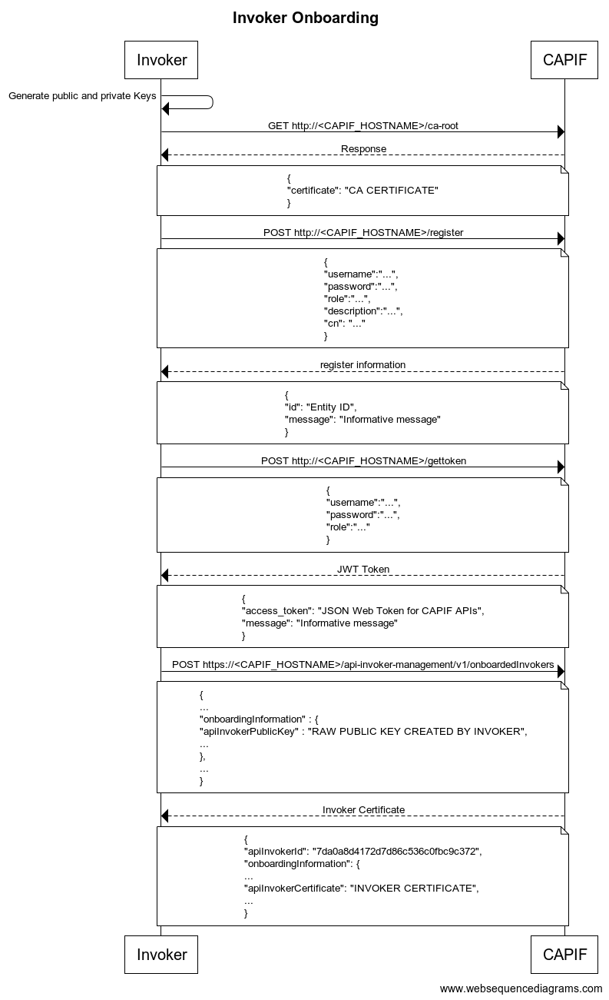
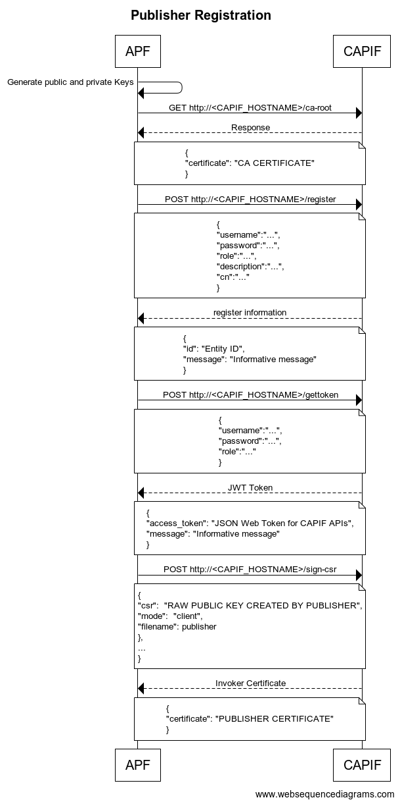

[**[Return To Main]**]
# Testing Using Curl

- [Testing Using Curl](#testing-using-curl)
  - [cURL scripts (TLS supported)](#curl-scripts-tls-supported)
  - [cURL manual execution](#curl-manual-execution)
    - [Authentication](#authentication)
      - [Invoker](#invoker)
      - [Provider](#provider)
    - [JWT Authentication APIs](#jwt-authentication-apis)
      - [Register an entity](#register-an-entity)
      - [Get access token for an existing entity](#get-access-token-for-an-existing-entity)
      - [Retrieve and store CA certificate](#retrieve-and-store-ca-certificate)
      - [Sign provider certificate](#sign-provider-certificate)
    - [Invoker Management APIs](#invoker-management-apis)
      - [Onboard an Invoker](#onboard-an-invoker)
      - [Update Invoker Details](#update-invoker-details)
      - [Offboard an Invoker](#offboard-an-invoker)
    - [Publish APIs](#publish-apis)
      - [Publish a new API.](#publish-a-new-api)
      - [Update a published service API.](#update-a-published-service-api)
      - [Unpublish a published service API.](#unpublish-a-published-service-api)
      - [Retrieve all published APIs](#retrieve-all-published-apis)
      - [Retrieve a published service API.](#retrieve-a-published-service-api)
    - [Discover API](#discover-api)
      - [Discover published service APIs and retrieve a collection of APIs according to certain filter criteria.](#discover-published-service-apis-and-retrieve-a-collection-of-apis-according-to-certain-filter-criteria)

## cURL scripts (TLS supported)
Also you can follow the instructions and run the commands of the bash scripts:
* [provider](./capif_tls_curls_exposer.sh) to test CAPIF as provider with TLS support.
* [invoker](./capif_tls_curls_invoker.sh) to test CAPIF as invoker with TLS support.

## cURL manual execution

### Authentication
This version will use TLS communication, for that purpose we have 2 different scenarios, according to role:
* Invoker
* Provider

#### Invoker
To authenticate an invoker user, we must perform next steps:
- Retrieve CA certificate from platform. [Retrieve and store CA certificate](#retrieve-and-store-ca-certificate)
- Register on the CAPIF with invoker role. [Register an entity](#register-an-entity)
- Get a Json Web Token (JWT) in order to request onboarding [Get access token for an existing entity](#get-access-token-for-an-existing-entity)
- Request onboarding adding public key to request. [Onboard an Invoker](#onboard-an-invoker)
- Store certificate signed by CAPIF platform to allow TLS onwards.

Flow:


#### Provider
To authenticate an provider user, we must perform next steps:
- Retrieve CA certificate from platform. [Retrieve and store CA certificate](#retrieve-and-store-ca-certificate)
- Register on the CAPIF with provider role. [Register an entity](#register-an-entity)
- Request sign the public key to CAPIF including beared with JWT. [Sign provider certificate](#sign-provider-certificate)
- Store certificate signed by CAPIF platform to allow TLS onwards.

Flow:


### JWT Authentication APIs
These APIs are triggered by an entity (Invoker or Provider for release 1.0) to:
- register on the CAPIF Framework
- get a Json Web Token (JWT) in order to be authorized to call CAPIF APIs

#### Register an entity
Request
```shell
curl --request POST 'http://<CAPIF_HOSTNAME>:<CAPIF_HTTP_PORT>/register' --header 'Content-Type: application/json' --data '{
    "username":"...",
    "password":"...",
    "role":"...",
    "description":"...",
    "cn":"..."
}'
```

* Role: invoker or publisher
* cn: common name

Response body
```json
{
  "id": "Entity ID",
  "message": "Informative message"
}
```

#### Get access token for an existing entity
Request
```shell
curl --request POST 'http://<CAPIF_HOSTNAME>:<CAPIF_HTTP_PORT>/gettoken' --header 'Content-Type: application/json' --data '{
    "username":"...",
    "password":"...",
    "role":"..."
}'
```

Response body
```json
{
  "access_token": "JSON Web Token for CAPIF APIs", 
  "message": "Informative message"
}
```

#### Retrieve and store CA certificate
```shell
curl --request GET 'http://<CAPIF_HOSTNAME>:<CAPIF_HTTP_PORT>/ca-root' 2>/dev/null | jq -r '.certificate' -j > <CA Certificate file>
```

#### Sign provider certificate
```shell
curl --request POST 'http://<CAPIF_HOSTNAME>/sign-csr' --header 'Authorization: Bearer <JWT access token>' --header 'Content-Type: application/json' --data-raw '{
  "csr":  "RAW PUBLIC KEY CREATED BY PUBLISHER",
  "mode":  "client",
  "filename": provider
}'
```
Response
``` json
{
  "certificate": "PUBLISHER CERTIFICATE"
}
```
PUBLISHER CERTIFICATE value must be stored by Provider entity to next request to CAPIF (provider.crt for example)

### Invoker Management APIs

These APIs are triggered by a NetApp (i.e. Invoker)

#### Onboard an Invoker

```shell
curl --cacert <CA Certificate file> --request POST 'https://<CAPIF_HOSTNAME>/api-invoker-management/v1/onboardedInvokers' --header 'Authorization: Bearer <Invoker JWT access token>' --header 'Content-Type: application/json' --data-raw '{
  "notificationDestination" : "http://X:Y/netapp_callback",
  "supportedFeatures" : "fffffff",
  "apiInvokerInformation" : <Invoker CommonName>,
  "websockNotifConfig" : {
    "requestWebsocketUri" : true,
    "websocketUri" : "websocketUri"
  },
  "onboardingInformation" : {
    "apiInvokerPublicKey" : <RAW PUBLIC KEY CREATED BY INVOKER>
  },
  "requestTestNotification" : true
}'
```

Response Body

``` json
{
  "apiInvokerId": "7da0a8d4172d7d86c536c0fbc9c372",
  "onboardingInformation": {
    "apiInvokerPublicKey": "RAW PUBLIC KEY CREATED BY INVOKER", 
    "apiInvokerCertificate": "INVOKER CERTIFICATE", 
    "onboardingSecret": "onboardingSecret"
    }, 
    "notificationDestination": "http://host.docker.internal:8086/netapp_callback", 
    "requestTestNotification": true, 
    ...
}
```

INVOKER CERTIFICATE value must be stored by Invoker entity to next request to CAPIF (invoker.crt for example)

#### Update Invoker Details

```shell
curl --location --request PUT 'https://<CAPIF_HOSTNAME>/api-invoker-management/v1/onboardedInvokers/<API Invoker ID>' --cert <Invoker Signed Certificate file> --key <Invoker Private Key> --cacert <CA Certificate file> --header 'Content-Type: application/json' --data '{
  "notificationDestination" : "http://X:Y/netapp_callback2",
  "supportedFeatures" : "fffffff",
  "apiInvokerInformation" : <Invoker CommonName>,
  "websockNotifConfig" : {
    "requestWebsocketUri" : true,
    "websocketUri" : "websocketUri2"
  },
  "onboardingInformation" : {
    "apiInvokerPublicKey" : <RAW PUBLIC KEY CREATED BY INVOKER>
  },
  "requestTestNotification" : true
}'
```

#### Offboard an Invoker

```shell
curl --cert <Invoker Signed Certificate file> --key <Invoker Private Key> --cacert <CA Certificate file> --request DELETE 'https://<CAPIF_HOSTNAME>/api-invoker-management/v1/onboardedInvokers/<API Invoker ID>' 
```

### Publish APIs

These APIs are triggered by the API Publishing Function (APF) of an Provider

#### Publish a new API.
```shell
curl --cert <Provider Signed Certificate file> --key <Provider Private Key> --cacert <CA Certificate file> --request POST 'https://<CAPIF_HOSTNAME>/published-apis/v1/<Provider Id>/service-apis'  --header 'Content-Type: application/json' --data '{
  "apiName": "3gpp-monitoring-event",
  "aefProfiles": [
    {
      "aefId": "string",
      "versions": [
        {
          "apiVersion": "v1",
          "expiry": "2021-11-30T10:32:02.004Z",
          "resources": [
            {
              "resourceName": "string",
              "commType": "REQUEST_RESPONSE",
              "uri": "string",
              "custOpName": "string",
              "operations": [
                "GET"
              ],
              "description": "string"
            }
          ],
          "custOperations": [
            {
              "commType": "REQUEST_RESPONSE",
              "custOpName": "string",
              "operations": [
                "GET"
              ],
              "description": "string"
            }
          ]
        }
      ],
      "protocol": "HTTP_1_1",
      "dataFormat": "JSON",
      "securityMethods": ["PSK"],
      "interfaceDescriptions": [
        {
          "ipv4Addr": "string",
          "port": 65535,
          "securityMethods": ["PSK"]
        },
        {
          "ipv4Addr": "string",
          "port": 65535,
          "securityMethods": ["PSK"]
        }
      ]
    }
  ],
  "description": "string",
  "supportedFeatures": "fffff",
  "shareableInfo": {
    "isShareable": true,
    "capifProvDoms": [
      "string"
    ]
  },
  "serviceAPICategory": "string",
  "apiSuppFeats": "fffff",
  "pubApiPath": {
    "ccfIds": [
      "string"
    ]
  },
  "ccfId": "string"
}'
```

#### Update a published service API.
```shell
curl --cert <Provider Signed Certificate file> --key <Provider Private Key> --cacert <CA Certificate file> --request PUT 'https://<CAPIF_HOSTNAME>/published-apis/v1/<APIF Id>/service-apis/<Service API Id>' --header 'Content-Type: application/json' --data '{
  "apiName": "3gpp-monitoring-event",
  "aefProfiles": [
    {
      "aefId": "string1",
      "versions": [
        {
          "apiVersion": "v1",
          "expiry": "2021-11-30T10:32:02.004Z",
          "resources": [
            {
              "resourceName": "string",
              "commType": "REQUEST_RESPONSE",
              "uri": "string",
              "custOpName": "string",
              "operations": [
                "GET"
              ],
              "description": "string"
            }
          ],
          "custOperations": [
            {
              "commType": "REQUEST_RESPONSE",
              "custOpName": "string",
              "operations": [
                "GET"
              ],
              "description": "string"
            }
          ]
        }
      ],
      "protocol": "HTTP_1_1",
      "dataFormat": "JSON",
      "securityMethods": ["PSK"],
      "interfaceDescriptions": [
        {
          "ipv4Addr": "string",
          "port": 65535,
          "securityMethods": ["PSK"]
        },
        {
          "ipv4Addr": "string",
          "port": 65535,
          "securityMethods": ["PSK"]
        }
      ]
    }
  ],
  "description": "string",
  "supportedFeatures": "fffff",
  "shareableInfo": {
    "isShareable": true,
    "capifProvDoms": [
      "string"
    ]
  },
  "serviceAPICategory": "string",
  "apiSuppFeats": "fffff",
  "pubApiPath": {
    "ccfIds": [
      "string"
    ]
  },
  "ccfId": "string"
}'
```

#### Unpublish a published service API.
```shell
curl --cert <Provider Signed Certificate file> --key <Provider Private Key> --cacert <CA Certificate file> --request DELETE 'https://<CAPIF_HOSTNAME>/published-apis/v1/<APF Id>/service-apis/<Service API Id>'
```

#### Retrieve all published APIs
```shell
curl --cert <Provider Signed Certificate file> --key <Provider Private Key> --cacert <CA Certificate file> --request GET 'https://<CAPIF_HOSTNAME>/published-apis/v1/<APF Id>/service-apis'
```

#### Retrieve a published service API.
```shell
curl --cert <Provider Signed Certificate file> --key <Provider Private Key> --cacert <CA Certificate file> --request GET 'https://<CAPIF_HOSTNAME>/published-apis/v1/<APF Id>/service-apis/<Service API Id>'
```

### Discover API

This API is triggered by a NetApp (or Invoker)

#### Discover published service APIs and retrieve a collection of APIs according to certain filter criteria.
```shell
curl --cert <Invoker Signed Certificate file> --key <Invoker Private Key> --cacert <CA Certificate file> --request GET 'https://<CAPIF_HOSTNAME>/service-apis/v1/allServiceAPIs?api-invoker-id=<API Invoker Id>&api-name=<API Name>&api-version=<API version e.g. v1>&aef-id=<AEF Id>&api-cat=<Service API Category>&supported-features=<SuppFeat>&api-supported-features=<API Suppfeat>'
```


[Return To Main]: ../../README.md#using-curl