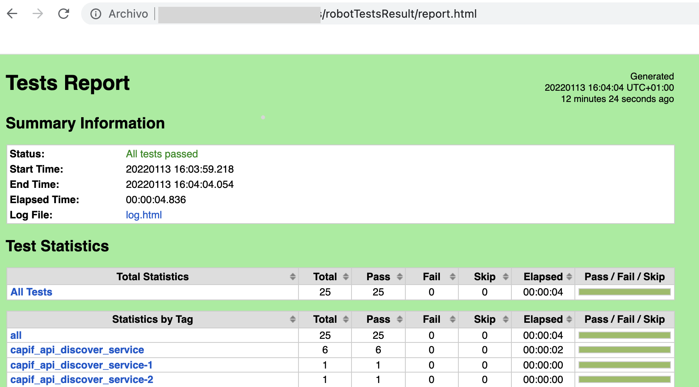
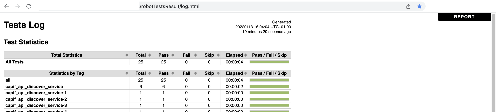

[**[Return To Main]**]
# Testing With Robot Framework

- [Testing With Robot Framework](#testing-with-robot-framework)
  - [Steps to Test](#steps-to-test)
  - [Script Test Execution](#script-test-execution)
  - [Manual Build And Test Execution](#manual-build-and-test-execution)
  - [Test result review](#test-result-review)

## Steps to Test

To run any test locally you will need *docker* and *docker-compose* installed in order run services and execute test plan. Steps will be:
* **Run All Services**: See section [Run All CAPIF Services](../../README.md#run-all-capif-services-locally-with-docker-images)
* **Run desired tests**: At this point we have 2 options:
  * **Using helper script**: [Script Test Execution](#script-test-execution)
  * **Build robot docker image and execute manually robot docker**: [Manual Build And Test Execution](#manual-build-and-test-execution)


## Script Test Execution
This script will build robot docker image if it's need and execute tests selected by "include" option. Just go to service folder, execute and follow steps.
```
./runCapifTests.sh --include <TAG>
```
Results will be stored at <REPOSITORY_FOLDER>/results

Please check parameters (include) under *Test Execution* at [Manual Build And Test Execution](#manual-build-and-test-execution).

## Manual Build And Test Execution

* **Build Robot docker image**:
```
cd tools/robot
docker build . -t 5gnow-robot-test:latest
```

* **Tests Execution**:
  
Execute all tests locally:
```
<PATH_TO_REPOSITORY>=path in local machine to repository cloned.
<PATH_RESULT_FOLDER>=path to a folder on local machine to store results of Robot Framework execution.
<CAPIF_HOSTNAME>=Is the hostname set when run.sh is executed, by default it will be capifcore.
<CAPIF_HTTP_PORT>=This is the port to reach when robot framework want to reach CAPIF deployment using http, this should be set to port without TLS set on Nginx, 8080 by default.

To execute all tests run :
docker run -ti --rm --network="host" -v <PATH_TO_REPOSITORY>/tests:/opt/robot-tests/tests -v <PATH_RESULT_FOLDER>:/opt/robot-tests/results 5gnow-robot-test:latest --variable CAPIF_HOSTNAME:capifcore --variable CAPIF_HTTP_PORT:8080 --include all
```

Execute specific tests locally:
```
To run more specific tests, for example, only one functionality:
<TAG>=Select one from list:
  "capif_api_discover_service",
  "capif_api_invoker_management",
  "capif_api_publish_service",
  "capif_api_events",
  "capif_security_api

And Run:
docker run -ti --rm --network="host" -v <PATH_TO_REPOSITORY>/tests:/opt/robot-tests/tests -v <PATH_RESULT_FOLDER>:/opt/robot-tests/results 5gnow-robot-test:latest --variable CAPIF_HOSTNAME:capifcore --variable CAPIF_HTTP_PORT:8080 --include <TAG>
```

## Test result review

In order to Review results after tests, you can check general report at <PATH_RESULT_FOLDER>/report.html or if you need more detailed information <PATH_RESULT_FOLDER>/log.html, example:
* Report:

* Detailed information:


**NOTE: If you need more detail at Robot Framework Logs you can set log level option just adding to command --loglevel DEBUG**


[Return To Main]: ../../README.md#robot-framework